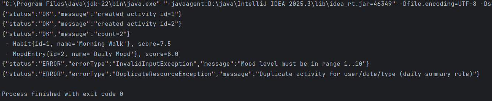
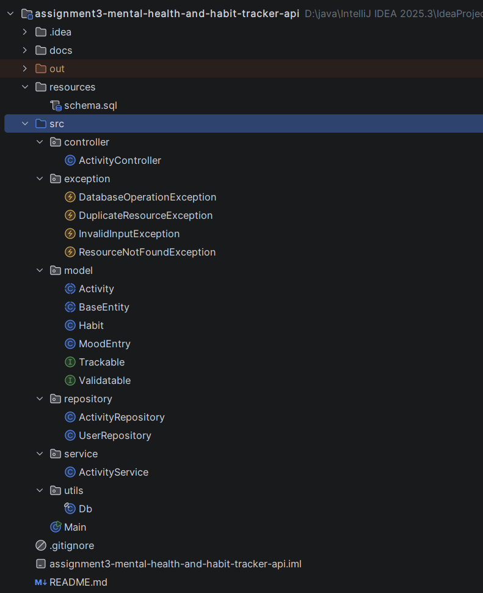
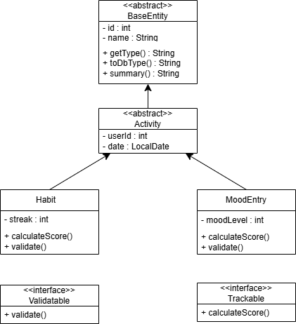
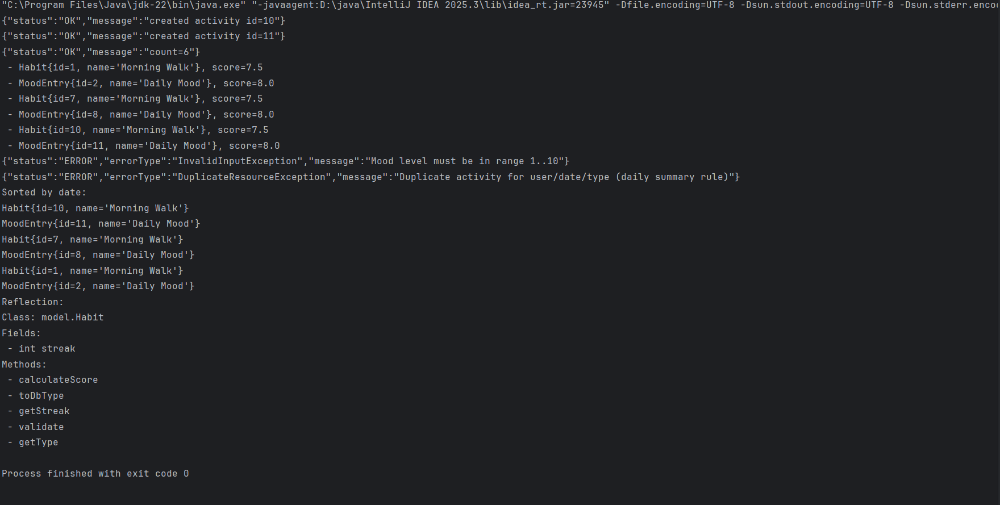
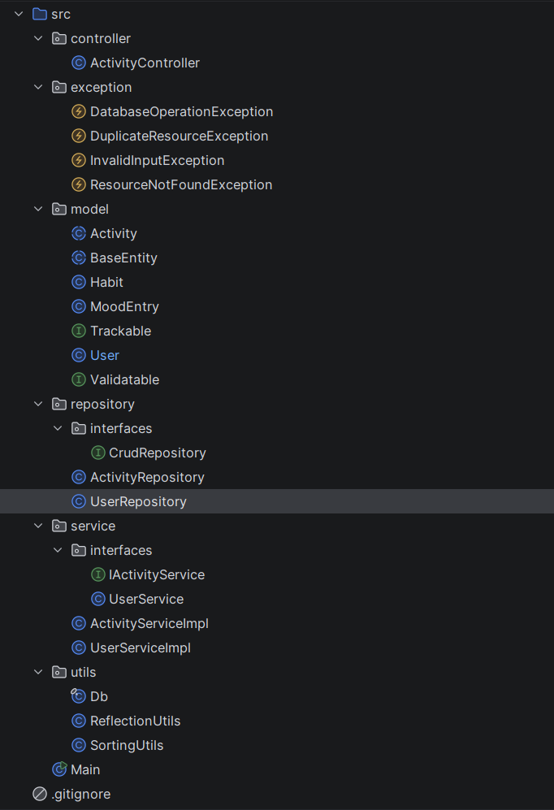

# Mental Health & Habit Tracker API

## Assignment 3 – JDBC & OOP API

This project is a **Mental Health & Habit Tracker API** implemented in Java to demonstrate
advanced Object-Oriented Programming concepts together with database interaction using JDBC.

The system allows users to track daily habits and record mood entries.
It enforces business rules such as allowing **only one habit and one mood entry per day per user.**
The project follows a **multi-layer architecture** and uses a PostgreSQL relational database.

---

## Class Hierarchy and Design
### BaseEntity (Abstract Class)

The `BaseEntity` class is an abstract superclass that defines common properties such as `id` and `name`.
It declares abstract methods that must be implemented by subclasses and provides a concrete summary method.

### Activity (Abstract Class)

The `Activity` class extends `BaseEntity` and represents a general activity performed by a user.
It stores shared fields such as `userId` and `date` and serves as a base class for all activity types.

### Habit and MoodEntry

The `Habit` and `MoodEntry` classes extend the Activity class and represent specific types of activities.

- Habit stores a habit streak and calculates a score based on consistency.

- MoodEntry stores a mood level (from 1 to 10) and calculates a score based on emotional state.

Both classes override abstract methods and demonstrate polymorphism when accessed through
the `Activity` base class.

### Interfaces

`Validatable` — ensures that input data is validated before database operations

`Trackable` — defines a scoring mechanism using calculateScore()

### Aggregation

Activities are associated with users through the `userId` field.
The User entity exists only at the database level, while the Java domain model
references users using identifier-based aggregation.
Referential integrity is enforced using foreign key constraints in the database.

---

## Database Design

The application uses a PostgreSQL database with two related tables:

- `users`

- `activities`

### Key Features

- Primary keys for all tables

- Foreign key (`activities.user_id → users.id`)

- Unique constraint to prevent duplicate daily entries

- Check constraints to validate mood range and habit streak

---

## JDBC and CRUD Operations

### The repository layer uses:

- `DriverManager`

- `PreparedStatement`

- `ResultSet`

### The following operations are implemented:

- Create activities

- Retrieve all activities

- Retrieve activity by ID

- Update activities

- Delete activities

---

## Exception Handling

### The project includes a custom exception hierarchy:

- `InvalidInputException`

- `DuplicateResourceException`

- `ResourceNotFoundException`

- `DatabaseOperationException`

Exceptions are handled in the controller layer and displayed as JSON-like messages in the console.

---

## Screenshots
### Program Output

### Project Structure

### UML Diagram

---

## Reflection

This assignment helped me better understand how abstraction and inheritance simplify application design.
Using JDBC improved my understanding of how Java applications interact with relational databases.
One challenge was correctly handling database constraints and converting SQL errors into meaningful
custom exceptions. Overall, this project strengthened my understanding of OOP principles,
multi-layer architecture, and database-driven applications.

---

## Assignment 4 – SOLID Architecture & Advanced OOP (Milestone 2)

In this milestone, the project was **refactored and extended** to follow **SOLID principles** and demonstrate advanced Java features.

---

## SOLID Principles

### Single Responsibility Principle (SRP)
- **Controller** handles input/output only
- **Service** handles validation and business rules
- **Repository** handles database access
- **Utils** handle sorting and reflection

Each class has one clear responsibility.

---

### Open–Closed Principle (OCP)
- The abstract class `Activity` can be extended with new activity types without modifying existing logic.
- Polymorphism allows new subclasses to work through base class references.

---

### Liskov Substitution Principle (LSP)
- `Habit` and `MoodEntry` correctly substitute `Activity`.
- All subclasses respect the base class contract and behave consistently.

---

### Interface Segregation Principle (ISP)
- Small, focused interfaces are used:
    - `Validatable` – validation logic
    - `Trackable` – score calculation

Classes implement only the interfaces they need.

---

### Dependency Inversion Principle (DIP)
- Controllers depend on **service interfaces**, not implementations.
- Services depend on **repository interfaces (`CrudRepository<T>`)**, not concrete classes.
- Dependencies are injected through constructors.

---

## Advanced Java Features

### Generics
A generic CRUD interface is used in the repository layer:

CrudRepository<T>

---

## Screenshots
### Program Output

### Project Structure

